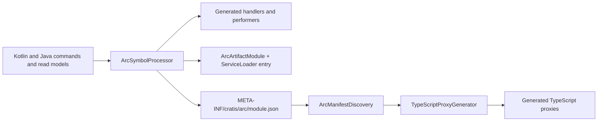

# KSP Code Generation

This rule governs `CodeGeneration/KSP` (`io.cratis:arc-ksp`): what the symbol processor reads, what
it generates, the manifest it emits as a transport contract, its stable `ARCKSP` diagnostic catalog,
and how a processor rule is changed together with its compile tests. Everything here is **framework
contract** unless marked otherwise — the compiler and the build enforce it.

## Entry points

`META-INF/services/com.google.devtools.ksp.processing.SymbolProcessorProvider` names exactly one
provider:

```text
io.cratis.arc.codegeneration.ksp.ArcSymbolProcessorProvider
```

`ArcSymbolProcessorProvider` is the only `public` type in the module; `CodeGeneration/KSP/api/KSP.api`
contains nothing else. `ArcSymbolProcessor` and every helper (`MetadataCollector`,
`ValidationMetadataExtractor`, `JavaRecordParser`, `EnumValueParser`, `Naming`, `Models`,
`ArcDiagnostics`) are `internal`. Keep it that way — widening one of them is a public ABI change.

The processor takes one option, `arc.moduleName`. `validateModuleName` in `Naming.kt` accepts only
`[A-Za-z_][A-Za-z0-9_]*` that is not a Kotlin keyword; anything else is rejected and no module is
generated. Consumers set it through `ksp { arg("arc.moduleName", "...") }`, or through the Gradle
plugin's `cratisArc.moduleName`, which forwards it.

## What the processor reads

`process(resolver)` replaces its metadata graph and provisional diagnostics each round:

1. Validate configuration and inspect command-like types with the existing diagnostics.
2. Accumulate stable command, read-model, derivative, and source-visible response-handler names;
   resolve them through the current resolver rather than retaining earlier-round semantic symbols.
3. Emit each valid invocation implementation once, while rebuilding response classification and the
   reachable metadata graph against the current discoveries. Handled-only response graphs are not
   retained unless another retained root reaches them.
4. Keep genuine unresolved symbols deferred, including explicit handler-annotation deferrals; do not
   discard a reported deferral merely because a second declaration-level `validate()` succeeds.

Command properties, type/interface properties, query descriptors, factories, and the manifest must
use the same reconstructed metadata. Concepts are a distinct successful collection category and do
not require an ordinary `TypeModel`. Do not repair only one cached list or the manifest.

Verified annotation fully-qualified names the processor reacts to:

| Annotation | Purpose in generation |
| --- | --- |
| `io.cratis.arc.artifacts.Command` | Marks a command; drives handler generation |
| `io.cratis.arc.artifacts.CommandKey` | Marks the command key property |
| `io.cratis.arc.artifacts.ReadModel` | Marks a read model; drives query performer generation |
| `io.cratis.arc.artifacts.FromServices` | Marks a handler or query parameter as service-resolved |
| `io.cratis.arc.artifacts.TreatWarningsAsErrors` | Escalates validation severity metadata |
| `io.cratis.arc.authorization.Authorize` | Authorization policy metadata |
| `io.cratis.arc.authorization.Roles` / `RolesContainer` | Role metadata (repeatable) |
| `io.cratis.arc.authorization.AllowAnonymous` | Anonymous access metadata |
| `io.cratis.arc.queries.Path` | Explicit query route; must be unique |
| `io.cratis.arc.queries.QueryHttpMethod` | GET versus RFC QUERY preference |
| `io.cratis.arc.queries.QueryTransport` | Request-response versus observable transport |
| `io.cratis.arc.commands.HandlesCommandResponseValues` | Declarative response-value handler |

Jakarta validation constraints on command properties and query parameters are read separately by
`ValidationMetadataExtractor` and projected into `ValidationRuleDescriptor` metadata.

## What the processor generates

Invocation implementations are emitted during processing. `finish()` flushes the final metadata
diagnostics and emits aggregate outputs once, only for a valid, resolved snapshot with a valid
module name and at least one command or query. The output consists of:

- One command handler per command, in `io.cratis.arc.generated.commands`, named
  `<Simple>ArcCommandHandler_<12 hex>` where the suffix is the first six bytes of the SHA-256 of the
  command's fully qualified name.
- One query performer per query, in `io.cratis.arc.generated.queries`, named
  `<method>ArcQueryPerformer_<12 hex>` over the fully qualified query name.
- One internal `io.cratis.arc.generated.<ModuleName>ArcArtifactMetadata` helper, whose factories
  construct fresh command/query descriptors. Invokers keep explicit descriptor types and public
  no-argument constructors; their metadata is stable per instance, not a shared singleton.
- One module class `io.cratis.arc.generated.<ModuleName>ArcArtifactModule` extending
  `io.cratis.arc.artifacts.ArcArtifactModule`, listing handlers, performers, types, enums,
  interfaces, and concepts — plus a
  `META-INF/services/io.cratis.arc.artifacts.ArcArtifactModule` entry so it is discoverable through
  `ServiceLoader`.
- One manifest resource at `META-INF/cratis/arc/<moduleName>.json`.

The helper, module, service entry, and manifest share explicit aggregating dependencies on the
terminal round's files. Replace that file snapshot every round; `Dependencies.ALL_FILES` can retain
invalid first-round source objects in KSP2. Keep per-invoker source associations and do not emit
placeholder files to force stabilization rounds. Provisional diagnostic nodes are likewise replaced
every round and published only through valid terminal callbacks; lifecycle changes require native
KSP error-location and incremental checks, not just embedded compilation tests.

Names are content-addressed and every collection is sorted before rendering (commands by qualified
name, queries by fully qualified name, types/interfaces/enums/concepts by fully qualified name).
Determinism is a contract: `GeneratedArtifactManifestTest` asserts the manifest is deterministic,
complete, and timestamp-free, and the whole TypeScript proxy chain depends on it. Never introduce a
timestamp, a hash of a file path, an iteration order that depends on the file system, or anything
else that can differ between two identical compilations.

## The manifest is a transport contract

`ArcArtifactManifest` (in `Source`, `io.cratis.arc.artifacts`) is the language-neutral document that
crosses the boundary from compile time to the Gradle plugin and the TypeScript generator. The code
declares:

```kotlin
@JsonPropertyOrder("formatVersion", "moduleName", "commands", "queries", "types", "interfaces", "enums", "concepts")
public class ArcArtifactManifest ... {
    public companion object {
        /** Current language-neutral manifest contract version. */
        public const val CURRENT_FORMAT_VERSION: Int = <n>
    }
}
```

Read the declared version from `ArcArtifactManifest.CURRENT_FORMAT_VERSION` rather than from this
file; it moves whenever the manifest contract does. `ArcManifestDiscovery` in `GradlePlugin` enforces
it strictly on read and will fail the build with a `GradleException` when a manifest:

- has no numeric `formatVersion`, or one that is not exactly `CURRENT_FORMAT_VERSION`;
- carries legacy flat fields (`typeName`, `isNullable`, `isEnumerable`, `elementTypeName`,
  `responseTypeName`, `isFromServices`) instead of canonical `shape` / `returnShape` / `source`
  metadata;
- uses an unknown type-shape `kind`, a nullable container entry, a non-`String` or nullable map key,
  a map value leaf outside the safe primitive set, or a map in a context that does not allow one;
- omits the boolean `hasDefault` on a query parameter;
- collides with another manifest on `moduleName`.

Consequences for any change to what the processor writes:

1. Adding, removing, or reshaping a manifest field is a **format change**. Bump
   `CURRENT_FORMAT_VERSION`, update `ArcManifestDiscovery`'s validation, and update the
   `GradlePlugin` tests that assert acceptance and rejection of each format.
2. Never write a field the reader rejects, and never relax the reader to accept output you did not
   intend to produce.
3. The manifest is consumed by released tooling. Treat a version bump as a breaking change and say so
   in the pull request.

## Diagnostics

Every compile-time message carries a stable code, emitted as `[ARCKSPxxxx] message`. The catalog is
the `ArcDiagnostic` enum in `ArcDiagnostics.kt` and is the single source of truth.
`CodeGeneration/KSP/DIAGNOSTICS.md` is generated from it by `ArcDiagnostic.referenceMarkdown()` and
asserted byte-equal by `ArcDiagnosticReferenceTest`.

| Code | Severity | Meaning |
| --- | --- | --- |
| `ARCKSP0001` | Error | Invalid KSP configuration |
| `ARCKSP0100` | Warning | Command-like type is missing `@Command` |
| `ARCKSP0101` | Error | Unsupported command declaration |
| `ARCKSP0102` | Error | Invalid command handle function |
| `ARCKSP0103` | Error | Invalid command provide function |
| `ARCKSP0104` | Error | Unsupported command method parameter |
| `ARCKSP0105` | Error | Unsupported command method return type |
| `ARCKSP0106` | Error | Ambiguous command key |
| `ARCKSP0107` | Warning | Provided value is not consumed by handle |
| `ARCKSP0108` | Error | Conflicting authorization metadata |
| `ARCKSP0109` | Error | Ambiguous command response values |
| `ARCKSP0200` | Error | Unsupported read model declaration |
| `ARCKSP0201` | Error | Invalid query function |
| `ARCKSP0202` | Error | Ambiguous query overload |
| `ARCKSP0203` | Error | Unsupported query parameter |
| `ARCKSP0204` | Error | Unsupported query return type |
| `ARCKSP0205` | Error | Query transport and return type disagree |
| `ARCKSP0206` | Error | Ambiguous or duplicate query route |
| `ARCKSP0207` | Error | Duplicate fully qualified query name |
| `ARCKSP0208` | Error | Invalid query infrastructure parameter |
| `ARCKSP0209` | Error | Unsupported Kotlin query parameter default |
| `ARCKSP0210` | Error | Invalid host query adapter shape |
| `ARCKSP0300` | Error | Unsupported generated proxy model shape |
| `ARCKSP0301` | Error | Invalid or unrepresentable Jakarta validation metadata |
| `ARCKSP0302` | Error | Ambiguous or unprovable Arc enum wire value |
| `ARCKSP0400` | Warning | Java/Kotlin interoperability hazard |
| `ARCKSP9999` | Error | Unclassified Arc KSP diagnostic |

Rules for diagnostics:

- **Prefer a compile-time diagnostic over a runtime failure.** If generated code could not invoke a
  shape safely, or a generated proxy would be uncompilable, stop the compilation with a precise
  message rather than emitting something that fails later. `ARCKSP0301` exists precisely so that an
  unrepresentable client constraint fails the build instead of silently weakening browser-side
  validation.
- **Report through the explicit overload.** `ArcDiagnosticReporter` has a
  `classify(message)` fallback that maps message prefixes onto a code; it exists for legacy call
  sites. New reporting must pass the `ArcDiagnostic` explicitly:
  `logger.error(ArcDiagnostic.QUERY_RETURN, "…", node)`. Falling through to
  `ArcDiagnostic.INTERNAL` (`ARCKSP9999`) in a new rule is a bug.
- **Codes are append-only.** Never renumber, never reuse a retired code, never change a code's
  meaning. Consumers and tests match on the literal string.
- Always pass the `KSNode` so the message lands on the offending declaration.
- Messages describe the offending shape and the fix, in American English, ending with what to do.

## Changing or adding a processor rule

1. Decide the authority level. If generated code cannot honor the shape, it is a framework contract
   and needs an error. If it merely risks a mistake, it is a warning (`ARCKSP0100`, `ARCKSP0107`,
   `ARCKSP0400` are the existing precedents).
2. Reuse the closest existing `ArcDiagnostic`. Add a new entry only for a genuinely new category, at
   the end of its numeric range.
3. Implement the check in `ArcSymbolProcessor` (or the relevant collector/extractor) and report with
   the explicit diagnostic overload plus the node.
4. Add a **positive** compile test proving the supported shape still generates correct output, in the
   matching `ArcSymbolProcessor*CompilationTest`.
5. Add a **negative** fixture under `ContractTests/src/negativeFixtures/{kotlin,java}/` and register
   its code, plus a distinctive message fragment, in `ArcSymbolProcessorNegativeCompilationTest`.
   Both languages when the rule applies to both.
6. If you added or changed a catalog entry, regenerate `CodeGeneration/KSP/DIAGNOSTICS.md` so it
   matches `ArcDiagnostic.referenceMarkdown()` exactly.
7. Run `./gradlew :CodeGeneration:KSP:test`, then the workspace gate, then the proxy gates if the
   manifest or generated shapes moved.

See [testing.md](./testing.md) for the compile-testing harness details.

## How generated output feeds the rest of the build



`ArcManifestDiscovery.discover` scans every classpath directory and jar for
`META-INF/cratis/arc/*.json`, validates each one, and `merge` flattens them into deterministically
sorted, de-duplicated artifact lists. `GenerateArcProxies` (the `generateArcProxies` Gradle task) and
`GenerateArcProxiesCli` both run exactly that pipeline — there is no second reader and no second
renderer. A change to what the processor emits is therefore always a change to the generated proxy
surface; finish it by running the gates in
[typescript-proxies.md](./typescript-proxies.md).

At runtime the generated module is discovered through `ServiceLoader` or registered explicitly with
`ArcArtifactModuleRegistry`, which is what makes command and query dispatch reflection-free.
