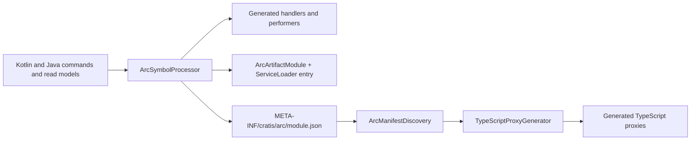

# Arc.Kotlin — project context

The JVM implementation of Arc for Kotlin and Java applications hosted by
Spring Boot: compile-time model-bound commands and queries, generated
TypeScript clients, servlet hosting, optional persistence and Chronicle
integrations, OpenAPI, and in-process test support. It does **not** claim
complete parity with Arc on .NET — the implemented and intentionally
unsupported areas are listed in `Documentation/reference/parity.md`.

This is a framework/library repository for Kotlin and Java on Spring Boot —
not an event-sourced application: do not apply C# conventions, application
vertical-slice layouts, or Chronicle event-modeling patterns.

## Workspace

Gradle multi-project build (`settings.gradle.kts` holds the module list);
published identities are `io.cratis:…`. Gradle needs a JDK 17 on
`JAVA_HOME`/`PATH` — export it before `./gradlew` if it cannot find one.
The `.api` public-surface baselines are enforced; a public API change that
survives review updates them deliberately.

## Commands

```bash
./gradlew build        # everything: compile, tests, .api checks
./gradlew test
```

The repository-local skills under `.agents/skills/` carry the Arc.Kotlin
procedures (Kotlin framework development, KSP code generation, JVM testing,
Java consumer API, TypeScript proxy contracts, porting from Arc .NET,
documentation authoring). The general Kotlin/JVM language guidance now lives
in `Cratis/AI`.

## Repository rules

The rules below were the repository-local corpus; they are authoritative for
this repository and kept here verbatim.

# Claiming Arc .NET Parity

This file governs every statement this repository makes about how Arc.Kotlin compares to Arc on
.NET: rows in `Documentation/reference/parity.md`, sentences in `README.md`, KDoc, commit messages,
pull request descriptions, and anything an agent reports back to a human. Parity is a claim about
*evidence*, not about intent or resemblance. `Documentation/reference/parity.md` is the authoritative
statement of status, its hedges are deliberate, and weakening one of them is a regression even when
no code changed.

## What "Arc .NET" is

Arc .NET is the reference implementation at `Cratis/Arc`
(read from a local read-only checkout, commonly the sibling `../Arc`). Its own `README.md` describes it as:

> "Arc is an open-source (MIT) opinionated CQRS application framework for ASP.NET Core with commands,
> queries, validation, authorization, and TypeScript proxy generation. It works without event
> sourcing, with optional Chronicle integration."

Orientation for reading it — all paths relative to that repository's root:

| Concern | Where it lives in Arc .NET |
| --- | --- |
| Host-neutral pipelines | `Source/DotNET/Arc.Core` (commands, queries, validation, authorization, authentication, identity, tenancy, introspection) |
| ASP.NET Core hosting | `Source/DotNET/Arc` |
| TypeScript proxy generation | `Source/DotNET/Tools/ProxyGenerator` — reflection over the built assembly plus Handlebars templates, run as a `dotnet` tool or an `AfterBuild` MSBuild target |
| Compile-time diagnostics | `Source/DotNET/Arc.Core.CodeAnalysis` (Roslyn analyzers, `ARC*` codes) and `Source/DotNET/Arc.Core.Generators` |
| Optional integrations | `Source/DotNET/{Chronicle,MongoDB,EntityFrameworkCore,OpenApi,Swagger}` |
| Shared client runtime | the npm packages `@cratis/arc`, `@cratis/arc.react`, and `@cratis/fundamentals` |

Two facts that repeatedly cause wrong claims: `ConceptAs<T>` is **not** defined in Arc .NET — it comes
from the external `Cratis.Fundamentals` package, whereas Arc.Kotlin defines its own
`io.cratis.arc.concepts.ConceptAs<T>` in `Source`. And Arc .NET contains **no** parity document,
parity test, or parity gate of its own; the entire parity contract lives in this repository. A
design note under `Arc/.ai-work/` is a local work artifact, not a specification — never cite it as
authority.

**That repository is read-only from here.** Never edit it, never copy its source, documentation, or
`.ai/` content into this repository, and never assume a behavior exists here because it exists there.

## The rules

### 1. Never upgrade a status without naming demonstrated evidence

`Documentation/reference/parity.md` defines its own bar in the status key:

> | Implemented | Available and covered by source tests, contract tests, integration tests, or
> runnable samples. |

A status change from `Partial` to `Implemented` (or the addition of an `Implemented` row) is only
valid when you can name the artifact that proves it, in the change itself:

- a **test** — module path and test class, for example
  `Integrations/SpringBoot/src/test/kotlin/io/cratis/arc/springboot/ArcQueryHostingTests.kt`;
- a **contract test** — a fixture or gate under `ContractTests`, for example
  `:ContractTests:typeScriptBuild` or `:ContractTests:typeScriptRuntimeTest`;
- a **runnable sample** — for example `Samples/Kotlin/SpringBoot` or `Samples/Java/SpringBoot`,
  including which task or request exercises it.

"It compiles", "`apiCheck` passes", and "the code looks correct" are not evidence of behavior. If you
cannot name the artifact, the row stays where it is and you say what is missing.

### 2. Verified by an executable check is not the same as read and compared

Keep these three claims distinct and never let the weaker one be written as the stronger:

| Claim | What you may write |
| --- | --- |
| An executable check asserts the behavior | "Implemented", and name the check |
| Behavior observed once by hand, no check | Describe it as observed, keep the status unchanged, and add the check before claiming it |
| The .NET source was read and looks equivalent | Say exactly that, in prose, with the .NET path — this is never a parity status |

Reading `Source/DotNET/...` and concluding "the JVM does the same thing" is a hypothesis. It becomes
a parity claim only after a JVM-side check fails when the behavior is broken.

### 3. The proxy differential is a normalized-fixture drift gate, not raw output equivalence

This is the caveat most likely to be overstated. `parity.md` says, verbatim:

> This remains a drift gate for the normalized fixture, not an exact raw .NET-output comparison;
> capture-time fixture preparation is not yet reproducible tooling.

Never describe `:GradlePlugin:test`'s `.NET`-derived comparison as "byte-identical to .NET output",
"proves proxy parity", or "the generated TypeScript matches Arc .NET". What it actually compares is
the sorted output path set and bodies of JVM output against a **repository-local expected fixture**,
after CRLF-to-LF and generated-header normalization, the fixture's capture-time namespace and
query-name casing transformations, and expected-side .NET import rewrites required by
`verbatimModuleSyntax`. It also carries one deliberate expected-side correction at
`Commands/CreateFixtures.ts` (`Command<ICreateFixtures, FixtureModel>` to
`Command<ICreateFixtures, FixtureModel[]>`), because the .NET side already calls
`super(FixtureModel, true)`. `parity.md` further limits what the map fixture proves:

> It proves that one string-key/string-value Record fixture, not non-string keys, nullable entries,
> typed model values, `ValueMap`, or broader dictionary parity.

Two invariants follow. **No normalization may ever transform JVM output** — normalizations exist only
on the expected side, so a JVM regression still fails the gate. And the fixture contains no `Guid`,
`DateOnly`, or `TimeOnly`, so the temporal/UUID mapping is covered by focused generator and contract
tests instead; do not attribute that coverage to the differential.

### 4. Overall parity is Partial, and specific boundaries are documented

State the overall position exactly as `parity.md` does:

> | Full Arc .NET parity | Partial | The semantically normalized .NET-derived proxy fixture covers
> selected generated shapes, but neither that fixture nor the project claims exact raw-output
> compatibility or every Arc .NET feature, analyzer, persistence seam, or hosting model. |

The following boundaries are documented and must not be smoothed over. Each was re-verified against
`Documentation/reference/parity.md` before being restated here:

- **Temporal mappings are lossy at the client.** `LocalDate`, `LocalTime`, and `UUID` map to
  `DateOnly`, `TimeOnly`, and `Guid` from `@cratis/fundamentals`, but "`LocalDateTime`, `Instant`,
  `OffsetDateTime`, and `ZonedDateTime` remain JavaScript `Date`", and mapping `LocalDateTime`
  "invents a zone" while `OffsetDateTime`/`ZonedDateTime` lose "original offset or zone identity".
  `OffsetTime` generates as untyped `string`. `Duration` is ISO-8601 text and is deliberately **not**
  Fundamentals `TimeSpan` "because Java and C# wire formats differ"; the tested `Period` contract is
  limited to Core round-trip plus TypeScript `string`. The `TimeOnly` behavior is truncation, not
  rounding: raw `08:09:10.1235567` hydrates as `08:09:10.123`, and `parity.md` explains why —
  "because rounding would yield `.124`". Arc accepts up to seven fractional digits for 100 ns
  compatibility, rejects eight or nine on deserialization, and rejects finer-than-100 ns on
  serialization rather than rounding or truncating.
- **Kotlin omitted-default handling is a JVM-specific contract with no C# counterpart.** "Omitted
  Kotlin client defaults execute at invocation, while supplied values, including explicit null,
  retain presence." Metadata records only *that* a default exists: introspection reports `hasDefault`
  and removes the parameter from `required`, OpenAPI marks it non-required with "no invented OpenAPI
  default", and generated TypeScript makes it optional "without copying a server literal". For
  validation, "an omitted Kotlin default has no pre-invocation value, so executable violations for
  that slot are ignored and the default executes at the model boundary". Shapes KSP cannot support
  fail with `ARCKSP0209` rather than falling back to reflection. Never describe any of this as
  matching .NET behavior.
- **Cross-store work is not a distributed transaction.** `parity.md` lists cross-store transactions
  as *Not planned*: "Chronicle, JPA, and MongoDB scopes cannot form one distributed atomic
  transaction; applications must design for partial completion and compensation." Chronicle staging
  is a commit barrier only — "No cross-store distributed transaction is provided" — and the P0
  backlog note is explicit that "MongoDB may commit before JPA fails, and both local stores may
  commit before Chronicle fails or has an indeterminate external outcome." Imperative JPA and
  MongoDB command transactions remain thread-bound, fixed-store opt-ins that are off by default.
  Never call any of this atomic, transactional across stores, or a distributed transaction.

### 5. Record intentional JVM divergence explicitly

When the JVM shape deliberately differs, say so in the row rather than letting the difference pass
silently. `parity.md` already uses a dedicated status for this:

> | JVM-specific | Supported with an intentionally JVM-native shape. |

Existing examples to follow: `suspend` and `CompletionStage` handlers, Kotlin `Flow` and JDK
`Flow.Publisher` observables, the Spring Data integrations, Kotlin ergonomics, the Java Core
adapters, and "Roslyn analyzers | JVM-specific | KSP compile-time diagnostics are the JVM substitute;
Roslyn does not apply." A divergence you introduce and do not record is a defect, because the next
reader will assume equivalence. Say which behavior differs, and why the JVM shape was chosen.

### 6. Quote the document; do not paraphrase it loosely

`Documentation/reference/parity.md` is worded carefully — "selected generated shapes", "remains a
drift gate", "no cross-store distributed transaction is provided", "not an exact precision
round-trip". When you restate a boundary anywhere else, quote the sentence or link to the row rather
than compressing it. A summary that drops a qualifier is how a hedge silently becomes a promise.
Loosening any existing wording requires the same evidence as a status upgrade.

## Editing `parity.md`

1. Land the behavior and its check first; the documentation change follows the evidence.
2. Edit only the rows your change affects, and keep the existing hedges of every other row byte for
   byte unless you are deliberately correcting one and can prove the correction.
3. Keep the "Current JVM contract" column describing what runs today, including the remaining
   boundary. A `Partial` row must state the boundary, not just the capability.
4. Reflect anything that changed for consumers in `README.md` (the "Current limits" section) and in
   the relevant `Documentation/reference/` page.
5. Run `./Documentation/verify-markdown.sh`.
6. In the pull request, name the test, contract test, or sample that justifies each status change,
   and name anything you did not verify.

## Reporting parity to a human

Say what ran, what passed, and what you did not check. "Matches Arc .NET" is not a report. Acceptable
shapes are: "`:ContractTests:typeScriptRuntimeTest` passes with the exact TAP totals; the .NET
differential still compares against the normalized fixture, so raw-output equivalence is unproven",
or "the behavior is implemented and covered by `ArcQueryHostingTests`; I did not verify the Arc .NET
side and make no parity claim." When in doubt, understate — see the verification discipline in
[general.md](./general.md) and the no-placeholder rule in [framework.md](./framework.md).

---

# Git and pull requests

This rule governs how work reaches `main` in Arc.Kotlin: branching, commit message style, what a pull
request must carry before it can merge, how a release is actually cut, and — most importantly — how a
pull request is merged. The merge policy and the history policy below are absolute: they are not
defaults to weigh against convenience.

## Branching

- **Never commit directly to `main`.** `main` is the default branch and the publish trigger. If you
  are on `main` and about to commit, create a branch first.
- Branch from an up-to-date `main`, one branch per pull request.
- Automation owns two observed prefixes in this repository: `dependabot/<ecosystem>/<dependency>` for
  Dependabot and `stagehand/work-<id>` for Cratis automation. Do not create branches under either
  prefix by hand.
- No human topic-branch convention is recorded in this repository's history yet, so this is a
  repository convention rather than an observed pattern: use a short, lowercase, hyphenated name,
  optionally prefixed with the change type — `fix/ksp-diagnostic-0109`, `docs/query-paging`,
  `feat/observable-hub-health`.

## Commit messages

Commits in this repository follow Conventional Commits, as `git log` shows:

```text
feat: establish Arc for Kotlin and Java
fix: align binary API baselines
fix: increase Kotlin daemon heap for CodeQL
build(deps-dev): bump eventsource in /ContractTests/TypeScript
```

- Use a `type:` or `type(scope):` prefix — `feat`, `fix`, `build`, `ci`, `docs`, `refactor`, `test`,
  `chore`.
- Subject in the imperative mood, lowercase after the prefix, no trailing period, ideally under 72
  characters.
- Use the body to explain **why**, and to name the gate or evidence that proved the change. Wrap the
  body at a readable width.
- One logical change per commit. Do not mix an unrelated `.api` baseline refresh, a dependency bump,
  and a behavior change in one commit.
- A deliberate public API change lands together with its regenerated `.api` baseline in the same
  commit, not as a later fix-up.
- Never commit build output, generated proxies, IDE files, or anything under `.ai-work/` or `.pi/` —
  see [local-work-artifacts.md](./local-work-artifacts.md).
- Do not commit, push, or open a pull request unless you were asked to.

## Before opening a pull request

Run the gates in the [general.md](./general.md) quality-gate table that your change can affect, and
`./Documentation/verify-markdown.sh` whenever anything under `Documentation/` changed. Push, then
watch CI: `Kotlin Build`, `Verify Semver Label`, `Verify No Work Records`, and CodeQL all run on pull
requests. The work is not done until CI is green, or the only failures are confirmed pre-existing and
unrelated.

The pull request **body is release-note copy**, and `cratis/release-action` generates the release
notes from it. Follow `.github/pull_request_template.md` exactly: an optional one-line `# Summary`,
then only the `##` sections that apply — `Added`, `Changed`, `Fixed`, `Removed`, `Security`,
`Deprecated` — in that order, with empty sections deleted. Each bullet is terse and user-facing and
ends with the real issue reference, for example `(#54)`. No extra sections, no prose, no verification
statistics, and no AI-attribution footer. A change with no user-facing effect contributes no bullet.

Reviewer context — what changed internally, which gates you ran with their results, and explicitly
what you did **not** verify — goes in a separate `gh pr comment`, never in the body.

## Release-intent label — required on every pull request

`.github/workflows/verify-semver-label.yml` calls the organization-wide reusable workflow
`Cratis/Workflows/.github/workflows/verify-release-intent.yml` on `opened`, `reopened`, `synchronize`,
`labeled`, and `unlabeled` for pull requests targeting `main`. It requires **exactly one** label from:

| Label | Meaning |
| --- | --- |
| `major` | Breaking release |
| `minor` | Backward-compatible feature release |
| `patch` | Backward-compatible fix release |
| `no-release` | The change ships nothing a consumer compiles against or runs |

The gate fails when there are zero of these labels, when two or more of `major`/`minor`/`patch` are
present, or when `no-release` is combined with any version label.

**Documentation-only changes are not exempt from labeling.** They are exempt from *versioning*: the
correct answer is `no-release`, which the workflow treats as a deliberate decision rather than an
omission. The same applies to CI, tooling, and spec-only changes. Dependabot pull requests in this
repository already carry `dependencies` and `no-release` via `.github/dependabot.yml`.

Never merge a pull request that has no release-intent label. `publish.yml` has a `verify-published`
job that fails after the fact when a merge published nothing and the merged pull request was not
labeled `no-release`.

## How a release is cut

- `publish.yml` runs on a push to `main` whose changes touch `Source/**`, `CodeGeneration/KSP/**`,
  `GradlePlugin/**`, the six `Integrations/**` modules, `Testing/**`, `build.gradle.kts`,
  `settings.gradle.kts`, or `gradle/**`. A merge that touches only `Documentation/**` or `.github/**`
  does not trigger it at all.
- It first re-verifies (`./gradlew clean build --no-configuration-cache` and
  `./Documentation/verify-markdown.sh`) plus the Chronicle real-kernel workflow, then `cratis/release-action`
  derives the version from the merged pull request's release-intent label, creates the GitHub release,
  and Gradle publishes the signed artifacts to Maven Central.
- **Serialize every merge that triggers `publish.yml`.** Before merging a pull request that touches
  any path listed above, confirm the latest `publish.yml` run is completed. After merging, wait for
  the resulting publish run to complete before merging another pull request that touches those paths.
  This applies even to `no-release`: its verification run occupies the same concurrency group.
  GitHub Actions keeps only one pending run per concurrency group even with
  `cancel-in-progress: false`; a newer pending run cancelled an older version-labelled run in #133.
  Do not treat the concurrency setting as a FIFO queue.
- A release can also be cut manually with `workflow_dispatch`, supplying an explicit version and
  release notes.
- Do not hand-edit versions: the local checkout builds as `0.0.0-SNAPSHOT` unless Gradle receives
  `-Pversion`.

## Merge policy — always a real merge commit

**Merge every pull request with `gh pr merge --merge`.** Never `--squash`, never `--rebase`, and never
the *Squash and merge* or *Rebase and merge* buttons.

A squash merge replaces the branch's commits with one new commit, and the branch is normally deleted
immediately afterwards, so nothing points at the originals any more. The commits on a branch are the
record of how the work was actually done, including the false starts; a tidier `main` is not worth
destroying that. A rebase merge replays the commits as new ones and has the same effect on the
original objects. Treat both as history rewrites even though they look like integration steps.

The repository currently permits all three merge methods
(`allow_merge_commit: true`, `allow_squash_merge: true`, `allow_rebase_merge: true`, default branch
`main`). That squash is *permitted* is not permission to use it. If the settings ever stop permitting
merge commits, **stop and ask a human** — that is a repository setting to change, not a reason to
squash.

The merges already on `main` are real merge commits (`Merge pull request #5 from ...`); keep it that
way.

## Never rewrite published history

- No `git push --force`, `-f`, or `--force-with-lease` on any pushed branch.
- No `git commit --amend`, `git rebase`, interactive rebase, `git reset` that drops commits, or
  `git filter-branch` on commits that have been pushed.
- Prefer additive history: add a follow-up commit instead of amending, `git revert` to undo,
  `git cherry-pick` to move a commit, and `git merge` instead of `git rebase` to take in `main`.
- If a situation seems to call for a force-push or any history rewrite, stop and ask first, and
  propose a non-destructive alternative.

## Work records never enter git

Plans, handovers, session notes, continuation prompts, status boards, and scratch analyses are never
committed, on any branch. `.ai-work/` and `.pi/` are gitignored; never `git add -f` anything inside
them and never remove those ignore entries. `.github/workflows/verify-no-work-records.yml` enforces
this on every pull request and every push to `main`. Details are in
[local-work-artifacts.md](./local-work-artifacts.md).

---

# Testing

This rule governs where tests live, how they are named, which JUnit 5 idioms this repository
actually uses, what belongs in a module's own tests versus `ContractTests`, how the KSP
compile-testing fixtures are structured, and the test-support surface published as
`io.cratis:arc-testing`. It is the depth behind the `AGENTS.md` requirement to use JUnit 5 and to
verify important APIs from both Kotlin and Java.

## Where tests live

| Location | Contains |
| --- | --- |
| `Source/src/test/kotlin/**` | Host-agnostic runtime unit tests |
| `Source/src/test/java/**` | Java conformance tests for the core public surface |
| `Integrations/<Name>/src/test/{kotlin,java}/**` | Integration unit tests, mostly Spring context tests |
| `Testing/src/test/{kotlin,java}/**` | Tests for the published scenario helpers |
| `CodeGeneration/KSP/src/test/kotlin/**` | KSP compile-testing and pure unit tests |
| `GradlePlugin/src/test/kotlin/**` | Manifest discovery, proxy rendering, and differential tests |
| `ContractTests/src/test/{kotlin,java}/**` | Cross-language contracts over generated artifacts |
| `ContractTests/src/testFixtures/{kotlin,java}/**` | Commands, read models, and models KSP processes |
| `ContractTests/src/negativeFixtures/{kotlin,java}/**` | Sources that must **fail** compilation |
| `ContractTests/src/chronicleRealKernelTest/kotlin/**` | Docker-backed kernel gate, outside `check` |
| `ContractTests/TypeScript/contracts/**` | TypeScript type and runtime contracts |

`ContractTests/src/negativeFixtures` is not a compiled Gradle source set. It is read as plain text by
`:CodeGeneration:KSP`'s tests through the `arc.contractNegativeFixtures` system property. Adding a
file there changes the KSP negative test, not the `ContractTests` compilation.

## Naming

Class naming is **not uniform across modules**, and that is the observed state. Match the module you
are editing rather than imposing one style:

- `*Test.kt` in `Source`, `CodeGeneration/KSP`, `GradlePlugin`, and `ContractTests`.
- `*Tests.kt` in all six `Integrations/**` modules and in `Testing`.
- Java: `*Test.java` in `Source`, `ContractTests`, `Integrations/SpringBoot`,
  `Integrations/Chronicle`, `Integrations/Observability`, and `Testing`;
  `*Tests.java` in `Integrations/SpringDataJpa` and `Integrations/SpringDataMongo`.
- Java consumer tests carry an explicit marker in the name — `...JavaConformanceTest`,
  `...JavaContractTest`, or a `Java`-prefixed class — so the Java-side coverage is findable.

This is a repository convention. It is not machine-enforced; consistency within a module is what
matters.

## JUnit 5 idioms used here

Kotlin tests use backticked, lowercase, behavior-describing method names. There are hundreds of them
and they are the house style:

```kotlin
class EndpointRouteHelperTest {
    @Test
    fun `command route uses package and dotnet compatible kebab casing`() {
        val descriptor = CommandDescriptor(
            "AddAuthor",
            "MyApp.Features.Authors.AddAuthor",
            location = listOf("MyApp", "Features", "Authors")
        )
        assertEquals(
            "/api/my-app/features/authors/add-author",
            EndpointRouteHelper.commandRoute(descriptor)
        )
    }
}
```

Java tests are package-private `final class` with `void` camelCase methods:

```java
final class GeneratedArtifactModuleJavaContractTest {
    @Test
    void generatedModuleIsAJavaFriendlyServiceProvider() {
        // ...
    }
}
```

Observed and expected:

- `org.junit.jupiter.api.Test` with statically imported `org.junit.jupiter.api.Assertions.*`
  (`assertEquals`, `assertTrue`, `assertFalse`, `assertThrows`, `assertNull`, `assertSame`).
  Plain JUnit assertions are the default; do not introduce a new assertion DSL.
- `@BeforeEach` / `@AfterEach`, `@TempDir`, and occasionally `@ParameterizedTest` with `@ValueSource`.
- Coroutine tests wrap the body in `runBlocking { }`.
- `@Nested` and `@DisplayName` are **not** used anywhere in this repository. Do not start.
- Mocking is sparse and module-specific: `io.mockk` in `Integrations/Chronicle` and `ContractTests`,
  Mockito (arriving transitively with `spring-boot-starter-test`) in the Spring Boot and Spring Data
  modules. AssertJ is available through the same starter and is used in a few Spring tests.
  Prefer exercising the real pipeline over mocking it — `arc-testing` exists for exactly that.

## Unit tests versus contract tests

Put a test in the owning module when it verifies that module's own behavior in isolation: a route
calculation, a descriptor's equality and immutability, an auto-configuration bean graph, a
processor's naming function, a proxy renderer's output.

Put it in `ContractTests` when it verifies the **public interoperability surface across languages or
across generation stages**:

- Generated command handlers and query performers executing through the real
  `DefaultCommandPipeline` / `DefaultQueryPipeline`.
- The generated `META-INF/cratis/arc/*.json` manifest being deterministic, complete, and
  timestamp-free.
- Kotlin and Java artifacts behaving identically for the same shape.
- Generated TypeScript proxy text, which is asserted from Kotlin in
  `GeneratedTypeScriptProxiesTest` using the `arc.contractTests.generatedProxies` system property.
  That test task depends on `:GradlePlugin:generateContractTestProxies`.

`ContractTests` is unpublished by design. Never move a fixture from it into a published module to
make an import work.

## Java-consumer testing is required for public API changes

Java is a first-class consumer language (`AGENTS.md`). When a change adds or reshapes a public API:

- Add or extend a Java test that calls it the way a Java application would — no Kotlin-only call
  patterns, no `Continuation` parameters, no default-argument reliance.
- Put it next to the existing Java coverage: `Source/src/test/java/io/cratis/arc/conformance/**` for
  the core, the integration's own `src/test/java/**` for a starter,
  `ContractTests/src/test/java/**` for a cross-language contract, and
  `Testing/src/test/java/JavaScenarioConformanceTest.java` for the scenario helpers.
- Update the `.api` baseline in the same change; see [gradle.md](./gradle.md).

A Kotlin-only test for a new public API is an incomplete change.

## KSP compile-testing fixtures

`:CodeGeneration:KSP` tests use `dev.zacsweers.kctfork:ksp` with `useKsp2()`,
`symbolProcessorProviders`, `kspWithCompilation`, and `kspProcessorOptions`. Two kinds of cases exist
and both are required when you change a processor rule.

Positive cases declare their sources inline and assert on generated output:

```kotlin
@OptIn(ExperimentalCompilerApi::class)
internal class ArcSymbolProcessorCommandResponseCompilationTest {
    @Test
    fun `Kotlin and Java aggregates produce ordered response metadata`() {
        val result = compile(listOf(SourceFile.kotlin("ResponseFixtures.kt", """ ... """)))
        // assert on exit code, generated sources, and manifest content
    }
}
```

The negative case is a single test over the whole fixture tree. It walks
`ContractTests/src/negativeFixtures` (supplied as `arc.contractNegativeFixtures` from
`CodeGeneration/KSP/build.gradle.kts`), compiles every `.kt` and `.java` file together, asserts
`KotlinCompilation.ExitCode.COMPILATION_ERROR`, and then asserts that specific `[ARCKSPxxxx]` codes
and specific message fragments appear in `result.messages`. To add a negative rule:

1. Add the offending fixture under `ContractTests/src/negativeFixtures/{kotlin,java}/`.
2. Add its diagnostic code to the assertion list in
   `ArcSymbolProcessorNegativeCompilationTest`, and assert a distinctive message fragment so the
   test fails if the diagnostic degrades into a generic one.
3. Run `./gradlew :CodeGeneration:KSP:test`.

`ArcDiagnosticReferenceTest` asserts that `CodeGeneration/KSP/DIAGNOSTICS.md` is byte-equal to
`ArcDiagnostic.referenceMarkdown()`. Changing the catalog without regenerating that file fails the
test. See [ksp.md](./ksp.md).

## Test fixtures and extra source sets

`ContractTests` applies `` `java-test-fixtures` ``. Fixtures are shared artifacts, not test-only
helpers: KSP is applied to the fixtures source set with `add("kspTestFixtures", project(":CodeGeneration:KSP"))`
and `ksp { arg("arc.moduleName", "ContractTests") }`, so the fixtures are what produce the manifest
the proxy generator reads. A new fixture therefore changes generated TypeScript output — re-run the
proxy gates from [typescript-proxies.md](./typescript-proxies.md).

`chronicleRealKernelTest` is a separately created source set with its own `Test` task. It is
deliberately outside `check`, uses Testcontainers against a digest-pinned Chronicle image, and fails
rather than skips when Docker is unavailable. Do not wire it into `check`.

## The published testing module

`:Testing` (`io.cratis:arc-testing`) is part of the product, not scaffolding. It exposes
`CommandScenario`, `QueryScenario`, `ObservableQueryScenario`, their result types,
`CommandScenarioExtender`, `ScenarioArtifactRegistry`, `ScenarioServiceResolver`, and Java-friendly
blocking and `CompletionStage` facades under `io.cratis.arc.testing.java`. It runs the real
pipelines and does not substitute fake handlers, and JSON round trips are on by default.

Because it is published it has a `.api` baseline (`Testing/api/Testing.api`) and its own Java
conformance test. Treat a change to it as a public API change: design it for both languages, prove
it from Java, and update the baseline deliberately.

## Do not import Cratis .NET testing conventions

This repository does **not** use, and must not adopt:

- `for_` / `when_` / `and_` specification folder or class hierarchies.
- `Cratis.Specifications`, `Should` extensions, or a given/when/then base-class mandate.
- NSubstitute, Moq, or any .NET mocking idiom translated into JVM form.
- One-behavior-per-class specification splitting.

The JVM house style is a plain JUnit 5 class per unit under test, with backticked Kotlin method names
or camelCase Java method names describing behavior. Carrying .NET test structure into this repository
is a defect, not a stylistic preference.

---

# KSP Code Generation

This rule governs `CodeGeneration/KSP` (`io.cratis:arc-ksp`): what the symbol processor reads, what
it generates, the manifest it emits as a transport contract, its stable `ARCKSP` diagnostic catalog,
and how a processor rule is changed together with its compile tests. Everything here is **framework
contract** unless marked otherwise — the compiler and the build enforce it.

## Entry points

`META-INF/services/com.google.devtools.ksp.processing.SymbolProcessorProvider` names exactly one
provider:

```text
io.cratis.arc.codegeneration.ksp.ArcSymbolProcessorProvider
```

`ArcSymbolProcessorProvider` is the only `public` type in the module; `CodeGeneration/KSP/api/KSP.api`
contains nothing else. `ArcSymbolProcessor` and every helper (`MetadataCollector`,
`ValidationMetadataExtractor`, `JavaRecordParser`, `EnumValueParser`, `Naming`, `Models`,
`ArcDiagnostics`) are `internal`. Keep it that way — widening one of them is a public ABI change.

The processor takes one option, `arc.moduleName`. `validateModuleName` in `Naming.kt` accepts only
`[A-Za-z_][A-Za-z0-9_]*` that is not a Kotlin keyword; anything else is rejected and no module is
generated. Consumers set it through `ksp { arg("arc.moduleName", "...") }`, or through the Gradle
plugin's `cratisArc.moduleName`, which forwards it.

## What the processor reads

`process(resolver)` replaces its metadata graph and provisional diagnostics each round:

1. Validate configuration and inspect command-like types with the existing diagnostics.
2. Accumulate stable command, read-model, derivative, and source-visible response-handler names;
   resolve them through the current resolver rather than retaining earlier-round semantic symbols.
3. Emit each valid invocation implementation once, while rebuilding response classification and the
   reachable metadata graph against the current discoveries. Handled-only response graphs are not
   retained unless another retained root reaches them.
4. Keep genuine unresolved symbols deferred, including explicit handler-annotation deferrals; do not
   discard a reported deferral merely because a second declaration-level `validate()` succeeds.

Command properties, type/interface properties, query descriptors, factories, and the manifest must
use the same reconstructed metadata. Concepts are a distinct successful collection category and do
not require an ordinary `TypeModel`. Do not repair only one cached list or the manifest.

Verified annotation fully-qualified names the processor reacts to:

| Annotation | Purpose in generation |
| --- | --- |
| `io.cratis.arc.artifacts.Command` | Marks a command; drives handler generation |
| `io.cratis.arc.artifacts.CommandKey` | Marks the command key property |
| `io.cratis.arc.artifacts.ReadModel` | Marks a read model; drives query performer generation |
| `io.cratis.arc.artifacts.FromServices` | Marks a handler or query parameter as service-resolved |
| `io.cratis.arc.artifacts.TreatWarningsAsErrors` | Escalates validation severity metadata |
| `io.cratis.arc.authorization.Authorize` | Authorization policy metadata |
| `io.cratis.arc.authorization.Roles` / `RolesContainer` | Role metadata (repeatable) |
| `io.cratis.arc.authorization.AllowAnonymous` | Anonymous access metadata |
| `io.cratis.arc.queries.Path` | Explicit query route; must be unique |
| `io.cratis.arc.queries.QueryHttpMethod` | GET versus RFC QUERY preference |
| `io.cratis.arc.queries.QueryTransport` | Request-response versus observable transport |
| `io.cratis.arc.commands.HandlesCommandResponseValues` | Declarative response-value handler |

Jakarta validation constraints on command properties and query parameters are read separately by
`ValidationMetadataExtractor` and projected into `ValidationRuleDescriptor` metadata.

## What the processor generates

Invocation implementations are emitted during processing. `finish()` flushes the final metadata
diagnostics and emits aggregate outputs once, only for a valid, resolved snapshot with a valid
module name and at least one command or query. The output consists of:

- One command handler per command, in `io.cratis.arc.generated.commands`, named
  `<Simple>ArcCommandHandler_<12 hex>` where the suffix is the first six bytes of the SHA-256 of the
  command's fully qualified name.
- One query performer per query, in `io.cratis.arc.generated.queries`, named
  `<method>ArcQueryPerformer_<12 hex>` over the fully qualified query name.
- One internal `io.cratis.arc.generated.<ModuleName>ArcArtifactMetadata` helper, whose factories
  construct fresh command/query descriptors. Invokers keep explicit descriptor types and public
  no-argument constructors; their metadata is stable per instance, not a shared singleton.
- One module class `io.cratis.arc.generated.<ModuleName>ArcArtifactModule` extending
  `io.cratis.arc.artifacts.ArcArtifactModule`, listing handlers, performers, types, enums,
  interfaces, and concepts — plus a
  `META-INF/services/io.cratis.arc.artifacts.ArcArtifactModule` entry so it is discoverable through
  `ServiceLoader`.
- One manifest resource at `META-INF/cratis/arc/<moduleName>.json`.

The helper, module, service entry, and manifest share explicit aggregating dependencies on the
terminal round's files. Replace that file snapshot every round; `Dependencies.ALL_FILES` can retain
invalid first-round source objects in KSP2. Keep per-invoker source associations and do not emit
placeholder files to force stabilization rounds. Provisional diagnostic nodes are likewise replaced
every round and published only through valid terminal callbacks; lifecycle changes require native
KSP error-location and incremental checks, not just embedded compilation tests.

Names are content-addressed and every collection is sorted before rendering (commands by qualified
name, queries by fully qualified name, types/interfaces/enums/concepts by fully qualified name).
Determinism is a contract: `GeneratedArtifactManifestTest` asserts the manifest is deterministic,
complete, and timestamp-free, and the whole TypeScript proxy chain depends on it. Never introduce a
timestamp, a hash of a file path, an iteration order that depends on the file system, or anything
else that can differ between two identical compilations.

## The manifest is a transport contract

`ArcArtifactManifest` (in `Source`, `io.cratis.arc.artifacts`) is the language-neutral document that
crosses the boundary from compile time to the Gradle plugin and the TypeScript generator. The code
declares:

```kotlin
@JsonPropertyOrder("formatVersion", "moduleName", "commands", "queries", "types", "interfaces", "enums", "concepts")
public class ArcArtifactManifest ... {
    public companion object {
        /** Current language-neutral manifest contract version. */
        public const val CURRENT_FORMAT_VERSION: Int = <n>
    }
}
```

Read the declared version from `ArcArtifactManifest.CURRENT_FORMAT_VERSION` rather than from this
file; it moves whenever the manifest contract does. `ArcManifestDiscovery` in `GradlePlugin` enforces
it strictly on read and will fail the build with a `GradleException` when a manifest:

- has no numeric `formatVersion`, or one that is not exactly `CURRENT_FORMAT_VERSION`;
- carries legacy flat fields (`typeName`, `isNullable`, `isEnumerable`, `elementTypeName`,
  `responseTypeName`, `isFromServices`) instead of canonical `shape` / `returnShape` / `source`
  metadata;
- uses an unknown type-shape `kind`, a nullable container entry, a non-`String` or nullable map key,
  a map value leaf outside the safe primitive set, or a map in a context that does not allow one;
- omits the boolean `hasDefault` on a query parameter;
- collides with another manifest on `moduleName`.

Consequences for any change to what the processor writes:

1. Adding, removing, or reshaping a manifest field is a **format change**. Bump
   `CURRENT_FORMAT_VERSION`, update `ArcManifestDiscovery`'s validation, and update the
   `GradlePlugin` tests that assert acceptance and rejection of each format.
2. Never write a field the reader rejects, and never relax the reader to accept output you did not
   intend to produce.
3. The manifest is consumed by released tooling. Treat a version bump as a breaking change and say so
   in the pull request.

## Diagnostics

Every compile-time message carries a stable code, emitted as `[ARCKSPxxxx] message`. The catalog is
the `ArcDiagnostic` enum in `ArcDiagnostics.kt` and is the single source of truth.
`CodeGeneration/KSP/DIAGNOSTICS.md` is generated from it by `ArcDiagnostic.referenceMarkdown()` and
asserted byte-equal by `ArcDiagnosticReferenceTest`.

| Code | Severity | Meaning |
| --- | --- | --- |
| `ARCKSP0001` | Error | Invalid KSP configuration |
| `ARCKSP0100` | Warning | Command-like type is missing `@Command` |
| `ARCKSP0101` | Error | Unsupported command declaration |
| `ARCKSP0102` | Error | Invalid command handle function |
| `ARCKSP0103` | Error | Invalid command provide function |
| `ARCKSP0104` | Error | Unsupported command method parameter |
| `ARCKSP0105` | Error | Unsupported command method return type |
| `ARCKSP0106` | Error | Ambiguous command key |
| `ARCKSP0107` | Warning | Provided value is not consumed by handle |
| `ARCKSP0108` | Error | Conflicting authorization metadata |
| `ARCKSP0109` | Error | Ambiguous command response values |
| `ARCKSP0200` | Error | Unsupported read model declaration |
| `ARCKSP0201` | Error | Invalid query function |
| `ARCKSP0202` | Error | Ambiguous query overload |
| `ARCKSP0203` | Error | Unsupported query parameter |
| `ARCKSP0204` | Error | Unsupported query return type |
| `ARCKSP0205` | Error | Query transport and return type disagree |
| `ARCKSP0206` | Error | Ambiguous or duplicate query route |
| `ARCKSP0207` | Error | Duplicate fully qualified query name |
| `ARCKSP0208` | Error | Invalid query infrastructure parameter |
| `ARCKSP0209` | Error | Unsupported Kotlin query parameter default |
| `ARCKSP0210` | Error | Invalid host query adapter shape |
| `ARCKSP0300` | Error | Unsupported generated proxy model shape |
| `ARCKSP0301` | Error | Invalid or unrepresentable Jakarta validation metadata |
| `ARCKSP0302` | Error | Ambiguous or unprovable Arc enum wire value |
| `ARCKSP0303` | Error | Missing or blank @DerivedType identifier |
| `ARCKSP0304` | Error | Unsupported @DerivedType declaration target |
| `ARCKSP0400` | Warning | Java/Kotlin interoperability hazard |
| `ARCKSP9999` | Error | Unclassified Arc KSP diagnostic |

Rules for diagnostics:

- **Prefer a compile-time diagnostic over a runtime failure.** If generated code could not invoke a
  shape safely, or a generated proxy would be uncompilable, stop the compilation with a precise
  message rather than emitting something that fails later. `ARCKSP0301` exists precisely so that an
  unrepresentable client constraint fails the build instead of silently weakening browser-side
  validation.
- **Report through the explicit overload.** `ArcDiagnosticReporter` has a
  `classify(message)` fallback that maps message prefixes onto a code; it exists for legacy call
  sites. New reporting must pass the `ArcDiagnostic` explicitly:
  `logger.error(ArcDiagnostic.QUERY_RETURN, "…", node)`. Falling through to
  `ArcDiagnostic.INTERNAL` (`ARCKSP9999`) in a new rule is a bug.
- **Codes are append-only.** Never renumber, never reuse a retired code, never change a code's
  meaning. Consumers and tests match on the literal string.
- Always pass the `KSNode` so the message lands on the offending declaration.
- Messages describe the offending shape and the fix, in American English, ending with what to do.

## Changing or adding a processor rule

1. Decide the authority level. If generated code cannot honor the shape, it is a framework contract
   and needs an error. If it merely risks a mistake, it is a warning (`ARCKSP0100`, `ARCKSP0107`,
   `ARCKSP0400` are the existing precedents).
2. Reuse the closest existing `ArcDiagnostic`. Add a new entry only for a genuinely new category, at
   the end of its numeric range.
3. Implement the check in `ArcSymbolProcessor` (or the relevant collector/extractor) and report with
   the explicit diagnostic overload plus the node.
4. Add a **positive** compile test proving the supported shape still generates correct output, in the
   matching `ArcSymbolProcessor*CompilationTest`.
5. Add a **negative** fixture under `ContractTests/src/negativeFixtures/{kotlin,java}/` and register
   its code, plus a distinctive message fragment, in `ArcSymbolProcessorNegativeCompilationTest`.
   Both languages when the rule applies to both.
6. If you added or changed a catalog entry, regenerate `CodeGeneration/KSP/DIAGNOSTICS.md` so it
   matches `ArcDiagnostic.referenceMarkdown()` exactly.
7. Run `./gradlew :CodeGeneration:KSP:test`, then the workspace gate, then the proxy gates if the
   manifest or generated shapes moved.

See [testing.md](./testing.md) for the compile-testing harness details.

## How generated output feeds the rest of the build



`ArcManifestDiscovery.discover` scans every classpath directory and jar for
`META-INF/cratis/arc/*.json`, validates each one, and `merge` flattens them into deterministically
sorted, de-duplicated artifact lists. `GenerateArcProxies` (the `generateArcProxies` Gradle task) and
`GenerateArcProxiesCli` both run exactly that pipeline — there is no second reader and no second
renderer. A change to what the processor emits is therefore always a change to the generated proxy
surface; finish it by running the gates in
[typescript-proxies.md](./typescript-proxies.md).

At runtime the generated module is discovered through `ServiceLoader` or registered explicitly with
`ArcArtifactModuleRegistry`, which is what makes command and query dispatch reflection-free.

---

# Spring Boot Integration

This file governs `Integrations/SpringBoot` (published as `io.cratis:arc-spring-boot-starter`) and
the Spring-facing surface of the other integrations: how autoconfiguration is structured, how
optional dependencies are expressed, how configuration properties are named and documented, and how
Spring bean lifetime interacts with Arc's coroutine model. Spring Boot 4.1.x is the **only** supported
host integration baseline — see the boundary rule at the end of this file. Arc uses Jackson 3.1.x
(`tools.jackson`) for its implementation and published API. Jackson annotations intentionally remain
under `com.fasterxml.jackson.annotation`, as required by Jackson 3 itself. Framework-wide design principles
live in [framework.md](./framework.md); build wiring lives in [gradle.md](./gradle.md).

## Dependency direction is one-way

- **`Source` must never depend on Spring.** Verified: there is no `org.springframework` reference
  anywhere under `Source/src/main/kotlin`. Host-neutral contracts (`CommandPipeline`,
  `QueryPipeline`, `CommandExecutionScope`, `ServiceResolver`, `TenantIdResolver`,
  `AuthenticationHandler`, `IdentityDetailsProvider`) live in `Source`; the Spring adaptation of each
  lives here.
- The starter's `build.gradle.kts` declares three `api` dependencies — `project(":Source")`,
  `spring-boot`, and `spring-boot-autoconfigure`. Jackson 3 is exposed transitively by `Source`.
  Everything else is deliberately `compileOnly`: `spring-boot-starter-webmvc`,
  `spring-boot-starter-websocket`, `spring-boot-starter-security`,
  `jakarta.validation:jakarta.validation-api`, and `spring-boot-configuration-processor`.
- Do not promote a `compileOnly` dependency to `api`/`implementation` to make something compile. If
  a feature needs a library at runtime, it belongs behind a `@ConditionalOnClass` guard with the
  library still `compileOnly`, or in a separate integration module.
- `Integrations/{SpringDataJpa,SpringDataMongo,OpenApi,Observability,Chronicle}` may depend on
  `Source` and on this starter; nothing depends back on them.

## Registered autoconfigurations

Exactly five classes are listed in
`Integrations/SpringBoot/src/main/resources/META-INF/spring/org.springframework.boot.autoconfigure.AutoConfiguration.imports`.
Know which layer you are editing:

| Class | Guarded by | Owns |
| --- | --- | --- |
| `ArcAutoConfiguration` | none (host-neutral) | registries, pipelines, authentication, authorization, tenancy resolution, introspection, artifact modules, coroutine scope, Jackson 3 wiring |
| `ArcCorrelationAutoConfiguration` | servlet application with `cratis.arc.correlation-enabled` enabled (the default) | host-wide correlation request wrapping, response headers, and servlet-thread MDC |
| `ArcValidationAutoConfiguration` | `@AutoConfiguration(after = [ArcAutoConfiguration::class])`, `@ConditionalOnClass(name = ["jakarta.validation.Validator"])` | the Jakarta Bean Validation command and query filters |
| `ArcWebAutoConfiguration` | `@ConditionalOnWebApplication(type = SERVLET)`, `@ConditionalOnClass(name = ["jakarta.servlet.Servlet", "org.springframework.web.servlet.DispatcherServlet"])` | servlet hosting: the authentication filter registration, observable-query transport, and the command/query handler mapping |
| `ArcObservableQueryWebSocketConfiguration` | `@ConditionalOnClass(name = ["org.springframework.web.socket.config.annotation.WebSocketConfigurer"])` plus `@ConditionalOnProperty(prefix = "cratis.arc.observable-queries", name = ["web-socket-enabled"], havingValue = "true", matchIfMissing = true)` | direct and multiplexed WebSocket routes |

`ArcAutoConfiguration` must keep working in a non-web application. Anything that touches
`HttpServletRequest`, `HttpRequestHandler`, `FilterRegistrationBean`, or a handler mapping belongs in
`ArcWebAutoConfiguration`, not in `ArcAutoConfiguration`.

Each of the other integrations registers exactly one autoconfiguration in its own `.imports` file:

| Module | Autoconfiguration | Boundary in one sentence |
| --- | --- | --- |
| `Integrations/SpringDataJpa` | `ArcSpringDataJpaAutoConfiguration` | Adapts Spring Data JPA to Arc — `QueryRequest`/`Pageable`/`Sort` and `Page<T>` conversion, tenant-certified `JpaPersistenceUnit` routing, command-side read-model resolution, an explicit change notifier for observable `Flow` snapshots, and an off-by-default imperative command transaction scope. |
| `Integrations/SpringDataMongo` | `ArcSpringDataMongoAutoConfiguration` | The same adaptation for Spring Data MongoDB, with tenant-certified `TenantMongoOperations` and change-stream-backed observable `Flow` snapshots. |
| `Integrations/OpenApi` | `ArcOpenApiAutoConfiguration` | Generates and caches an OpenAPI 3.1 document from Arc artifact metadata and serves it at `/v3/api-docs` and `/.cratis/openapi.json`, backing off its document bean when the application supplies its own `OpenAPI` or `ArcOpenApiDocument`. |
| `Integrations/Observability` | `ArcObservabilityAutoConfiguration` | Decorates Arc command, query, authentication, and identity execution with Micrometer observations plus optional OpenTelemetry baggage and SLF4J MDC correlation. |
| `Integrations/Chronicle` | `ChronicleArcAutoConfiguration` | Adds tenant-aware Chronicle event-store resolution, a staged command transaction, event response-value handlers, read-model resolution/release, and a reactor command-side-effect handler. |

## Optionality is expressed with conditions, never with a hard dependency

- **Web and security must remain optional.** `ArcWebAutoConfiguration` guards on servlet classes by
  *name*, and Spring Security is handled by two mutually exclusive nested configurations:
  `ArcWebAutoConfiguration.Security` (`@ConditionalOnClass(name = ["org.springframework.security.core.Authentication"])`)
  supplies `SpringSecurityArcPrincipalFactory`, while `ArcWebAutoConfiguration.ServletIdentity`
  (`@ConditionalOnMissingClass("org.springframework.security.core.Authentication")`) supplies
  `ServletArcPrincipalFactory`. Never make Spring Security a required dependency, and never let one
  of those two paths become the only path.
- **Use the string form of `@ConditionalOnClass`** when the guarded type is not on this module's
  compile classpath in every configuration, as `ArcWebAutoConfiguration` and
  `ArcValidationAutoConfiguration` do. Class-literal conditions are appropriate only where the
  module already declares the dependency (for example
  `@ConditionalOnClass(EntityManagerFactory::class, PlatformTransactionManager::class)` in the JPA
  integration).
- **Optional-by-property behavior uses `@ConditionalOnProperty` with an explicit default.** WebSocket
  hosting is `matchIfMissing = true` (on unless disabled); the imperative JPA and MongoDB command
  transaction scopes are opt-in and stay off unless
  `cratis.arc.spring-data.{jpa,mongodb}.command-transactions-enabled=true`.
- **Every default bean backs off for an application bean.** Use `@ConditionalOnMissingBean(Type::class)`
  when the contract type is Arc's own (`TenantIdResolver`, `QueryRenderers`, `ReadModelInterceptors`,
  `QueryHealthTracker`, `ObservableQueryEmissionGuards`). Use the **named** form —
  `@Bean("arcJakartaBeanValidationCommandFilter")` with
  `@ConditionalOnMissingBean(name = ["arcJakartaBeanValidationCommandFilter"])` — when the declared
  return type is a type applications legitimately register many of (`CommandFilter`, `QueryFilter`,
  `JsonMapperBuilderCustomizer`, `FilterRegistrationBean`, `SimpleUrlHandlerMapping`). The Jackson
  defaults bean retains the historical `arcJacksonCustomizer` name while using Boot 4's native,
  non-deprecated Jackson 3 builder customizer.
  Getting this wrong silently disables Arc's own bean; a bean-backoff test is required.
- **Collect application contributions with `ObjectProvider<T>.orderedStream()`**, so Spring `@Order`
  is the complete and documented precedence rule, as `arcCommandPipeline`, `arcQueryRenderers`, and
  `arcAuthentication` all do.

## Configuration properties

- The prefix is `cratis.arc` and nothing else. `ArcProperties` is `@ConfigurationProperties("cratis.arc")`
  with nested `EndpointProperties`, `ObservableQueryProperties`, and `ArcTenancyProperties`; the
  observability starter adds `cratis.arc.observability` through `ArcObservabilityProperties`.
- **Property classes are Java, with getters and setters** (`ArcProperties.java`,
  `ArcTenancyProperties.java`, `ArcObservabilityProperties.java`). Keep them that way: relaxed
  binding, the configuration processor, and Java consumers all depend on the JavaBean shape.
- **Property names are kebab-case in configuration and camelCase in code**
  (`coroutine-parallelism` ↔ `coroutineParallelism`). Enable a new autoconfiguration through a
  property only when a class-presence condition cannot express the same thing.
- **Validate in the setter and say what is wrong.** The established pattern throws
  `IllegalArgumentException` with an actionable message —
  `"coroutineParallelism must be greater than zero."` — so the application fails at startup, not at
  the first request.
- **A new property requires three edits in the same commit:**
  1. the field, getter, and validating setter on the properties class;
  2. an entry in `src/main/resources/META-INF/additional-spring-configuration-metadata.json` with
     `type`, `defaultValue`, and a `description` (only `Integrations/SpringBoot` and
     `Integrations/Observability` currently ship this file);
  3. a row in `Documentation/reference/configuration.md` with the exact default.
- Properties consumed only by `@ConditionalOnProperty` still need the documentation row. The
  `cratis.arc.spring-data.jpa.*` and `cratis.arc.spring-data.mongodb.*` switches have no
  `@ConfigurationProperties` class and no metadata file today; their only published description is
  `Documentation/reference/configuration.md`. Do not silently add more properties in that shape.
- Never change an existing default without treating it as a breaking change to consuming
  applications.

## Bean lifecycle, scope, and coroutines

- **Arc work runs in one application-owned scope.** `ArcApplicationCoroutineScope` is registered as
  `@Bean(destroyMethod = "close")` and constructed from `coroutineParallelism` and
  `coroutineQueueCapacity`. It owns a bounded `ThreadPoolExecutor` plus a `Semaphore` admission gate,
  and its `tryLaunch` returns `null` when capacity is exhausted so the host can fail closed. Never
  use `GlobalScope`, `runBlocking` on a request thread, or an unbounded dispatcher.
- **Any bean holding a closable runtime declares `destroyMethod`.** `arcObservableQueryTransport` is
  registered as `@Bean(name = ["arcObservableQueryTransport"], destroyMethod = "close")` for the same
  reason.
- **No `ThreadLocal` for coroutine-visible state, and no request-scoped beans on an Arc path.** A
  coroutine can resume on another thread, so request state is captured *once at transport entry* into
  an explicit immutable object and then passed: `ArcPrincipalFactory` produces an `ArcPrincipal`
  before suspension, and `ArcTenantResolutionService` builds a `TenantResolutionContext` from headers,
  first query-parameter values, host, and claims. Follow that pattern for anything new — do not read
  `SecurityContextHolder` or `RequestContextHolder` after entry.
- **Arc beans are singletons; per-call resolution goes through `ServiceResolver`.**
  `SpringServiceResolver` resolves each generated handler dependency with
  `applicationContext.getBeanProvider(type).ifAvailable`, which is how a prototype- or
  request-scoped application service still works. Do not inject application services directly into
  Arc infrastructure beans.
- **Generated artifacts are discovered once.** `ArcArtifactModules` merges `ServiceLoader`-provided
  and Spring-bean `ArcArtifactModule` instances, deduplicates by concrete class, orders by fully
  qualified class name, and registers them through `ArcArtifactModuleRegistry`. A bean that needs
  artifacts to be registered must depend on `ArcArtifactModules`, not on ordering luck.
- **Fail startup, not the first request, on unrecoverable configuration.** The context deliberately
  fails with messages such as `"Exactly one Arc identity details provider may be registered; found 2"`
  and `"Duplicate Arc POST route '/api/duplicates/same-command'"` that name both offending artifacts.
  Match that quality when adding a startup check.

## Adding or changing an autoconfiguration

1. Decide the layer: host-neutral (`ArcAutoConfiguration`), optional-library
   (`ArcValidationAutoConfiguration`-style), servlet (`ArcWebAutoConfiguration`), or a new
   integration module. Prefer a new bean in an existing class over a new autoconfiguration class.
2. Order it explicitly with `@AutoConfiguration(after = [...])` when it consumes another Arc bean;
   `ArcWebAutoConfiguration` is `after = [ArcAutoConfiguration::class, ArcValidationAutoConfiguration::class]`.
3. Guard every optional dependency with `@ConditionalOnClass`/`@ConditionalOnMissingClass`, keep that
   dependency `compileOnly`, and give the bean a `@ConditionalOnMissingBean` (typed or named) backoff.
4. Register a genuinely new autoconfiguration class in that module's `AutoConfiguration.imports`
   file — an unregistered class is dead code.
5. Test it with Spring Boot's context runners, which is the established convention here:
   `ApplicationContextRunner` for host-neutral wiring and `WebApplicationContextRunner` for servlet
   wiring, composed with Boot's native `JacksonAutoConfiguration`, `ArcAutoConfiguration`, and the relevant web/security auto-configurations.
   Cover at least: the default bean is present; an application `withBean(...)` replaces it
   (`assertSame`); property variants behave (`withPropertyValues("cratis.arc.tenancy.resolvers=subdomain", ...)`);
   and invalid configuration fails startup with the exact message
   (`assertThat(context).hasFailed()` plus `hasStackTraceContaining(...)`).
6. Update the `.api` baseline if a public type or bean method signature changed, then
   `Documentation/reference/configuration.md` and the relevant guide.

## Spring Boot 4.1.x is the only supported host baseline

Spring Boot 4 and Arc share one Jackson 3 mapper. Arc contributes `ArcJacksonModule` plus a native
`JsonMapperBuilderCustomizer` named `arcJacksonCustomizer`, so generated Arc endpoints and
conventional MVC controllers use the same naming, inclusion, temporal, enum, concept, and derived-type
wire policy. Application-supplied mappers remain authoritative because Jackson 3 mappers are
immutable; create an Arc-configured replacement with `ArcObjectMapper.configure(mapper)` when needed.

Hold unverified Spring Boot minors at 4.1.x until their managed Jackson and coroutines versions are
synchronized deliberately.

`AGENTS.md`, `README.md`, and `Documentation/reference/parity.md` all state that Spring Boot is the
only host, and the parity
matrix lists **Non-Spring hosting** as *Not planned*: "Spring Boot is the only supported host
integration; Core remains host-independent." Do not add Ktor, Micronaut, Quarkus, a raw servlet
container, or a Spring WebFlux host, and do not add abstractions whose only purpose is to make a
second host possible. `Controllers` are likewise *Not planned* — Arc generates model-bound Spring MVC
endpoints, and a hand-written controller is not the extension mechanism. If a request seems to
require another host, stop and raise it rather than starting one.

---

# Generated TypeScript Proxies

This rule governs the generated TypeScript proxy surface this repository owns. **Arc.Kotlin has no
TypeScript UI** — there is no React application, no component library, no frontend build to maintain.
It does own a **generated TypeScript proxy contract**: the Gradle plugin renders `.ts` clients from
Arc artifact manifests, and three gates prove that output is deterministic, strictly compilable, and
correct against a real running JVM host. Saying "this repository has no TypeScript" is wrong and
leads to skipped gates.

## What generates proxies

One renderer, reached two ways:

- `GenerateArcProxies` — the `generateArcProxies` task registered by the `io.cratis.arc` plugin
  (`GradlePlugin/src/main/kotlin/io/cratis/arc/gradle/ArcGradlePlugin.kt`). It is wired into `build`,
  is skipped until `cratisArc.proxies.outputDirectory` is set, and reads the main output, compile
  classpath, and runtime classpath.
- `io.cratis.arc.gradle.GenerateArcProxiesCli` — the command-line entry point used by the sample and
  contract-test generation tasks in this repository, which register their own `JavaExec` tasks rather
  than applying the plugin to themselves.

Both call `ArcManifestDiscovery.discover` / `merge` and then `TypeScriptProxyGenerator`. There is no
second renderer; do not add one.

CLI options, verified in `GenerateArcProxiesCli`: `--manifest-classpath` (repeatable),
`--output-directory`, `--route-prefix`, `--route-segments-to-skip`, `--include-command-names`,
`--include-query-names`, `--enable-query-http-method`, `--remove-stale-generated-files`,
`--proxy-segments-to-skip`. Unknown options are a hard failure.

## The generated-file contract

Every generated file begins with a marker line carrying the source artifact and a SHA-256 of the
body:

```text
// @generated by Cratis. Source: <fully qualified name>. Hash: <64 hex>
```

`TypeScriptProxyGenerator` enforces the surrounding rules:

- The body is normalized to LF and a single trailing newline before hashing and writing.
- A file whose content is unchanged is not rewritten.
- A file **without** the marker is never overwritten — the generator throws
  "Refusing to overwrite hand-written TypeScript file".
- Stale cleanup deletes only `.ts` files that carry the marker, are not `index.ts`, and are no longer
  expected. Hand-written files survive.
- `index.ts` files are merged, not clobbered: existing `export * from '...'` lines and any manual
  lines are preserved, generated exports are inserted in case-insensitive order, and removed exports
  are dropped.
- Output paths and names are validated: path segments must match `^[A-Za-z0-9_$-]+$`, TypeScript
  names must match `^[A-Za-z_$][A-Za-z0-9_$]*$`, the destination must stay inside the output
  directory, and duplicate output paths or duplicate imported TypeScript names fail generation.

## Determinism is a hard requirement

Regenerating from the same manifests must produce **byte-identical** files. This is not a style
preference; a gate proves it on every build.

`:GradlePlugin:verifyContractTestProxyDeterminism` runs a four-task chain defined in
`GradlePlugin/build.gradle.kts`:

1. `generateContractTestProxies` — depends on `:ContractTests:kspTestFixturesKotlin`, runs
   `GenerateArcProxiesCli` against the real `ContractTests` manifest into
   `ContractTests/TypeScript/generated`.
2. `captureContractTestProxyHashes` — writes a sorted `path SHA-256` snapshot of every `.ts` file.
3. `generateContractTestProxiesSecondPass` — regenerates with identical arguments.
4. `verifyContractTestProxyDeterminism` — recomputes the hashes and fails with
   "Contract test TypeScript proxies changed between consecutive generations." on any difference.

Anything that can vary between two runs breaks this gate: a timestamp in output, a set or map
iterated without sorting, a hash over an absolute path, a locale-sensitive comparison. The manifest
side is held to the same standard — see [ksp.md](./ksp.md).

## Strict-mode compilation

`:ContractTests:typeScriptBuild` proves the generated clients compile against the real published
packages. It depends on `typeScriptInstall` (`npm ci --ignore-scripts`, so `package-lock.json` is
authoritative), on `verifyContractTestProxyDeterminism` via the prepare tasks, and on the sample
proxy generation, then runs `npm run build` — which is `tsc --noEmit`.

`ContractTests/TypeScript/tsconfig.json` is the contract:

```json
{
  "compilerOptions": {
    "target": "ES2022",
    "module": "ESNext",
    "moduleResolution": "Bundler",
    "verbatimModuleSyntax": true,
    "strict": true,
    "noEmit": true,
    "experimentalDecorators": true,
    "useDefineForClassFields": false,
    "forceConsistentCasingInFileNames": true
  },
  "include": ["generated/**/*.ts", "contracts/**/*.ts"]
}
```

`verbatimModuleSyntax` means a type-only import that is emitted as a value import fails compilation.
Generated interfaces and type-only dependencies must use `import type`. The dependencies are pinned
(`@cratis/arc` and `@cratis/arc.react` 22.7.0, `@cratis/fundamentals` 7.18.2, TypeScript 5.9.3);
**do not bump them unless asked** — that is the dependency-manifest rule in
[gradle.md](./gradle.md), and these pins are what make the gate meaningful.

## The runtime TAP gate and its exact totals

`:ContractTests:typeScriptRuntimeTest` runs `npm run test:runtime`
(`node contracts/run-runtime-gate.mjs`). It boots the executable Kotlin Spring Boot sample jar,
waits for `Tomcat started on port …`, then runs three child processes and parses each one's TAP
summary.

| Child run | Contract | Time zone | Expected tests |
| --- | --- | --- | --- |
| calendar runtime contract | `contracts/runtime.calendar.contract.ts` | `UTC` | 5 |
| calendar runtime contract | `contracts/runtime.calendar.contract.ts` | `America/Los_Angeles` | 5 |
| general runtime contract | `contracts/runtime.contract.ts` | `UTC` | 15 |

`enforceTapSummary` requires, per child run:

- `tests` exactly equal to the expected count, and `pass` exactly equal to the same count;
- `fail`, `cancelled`, `skipped`, and `todo` all exactly `0`;
- every one of those six summary fields present, appearing once, and numeric.

A missing field, a duplicated field, an extra test, or a single skipped test fails the gate. A Spring
process-spawn error fails cleanly rather than hanging. **Adding or removing a runtime test means
updating `expectedTests` in `run-runtime-gate.mjs` in the same change** — the gate is deliberately
exact so that a silently dropped test cannot pass.

`:ContractTests:typeScriptRuntimeHarnessTest` (`npm run test:runtime-harness`) runs five Node unit
tests over the harness itself, covering an exact successful summary, a skipped test, a missing field,
a count mismatch, and a spawn error. `typeScriptRuntimeTest` depends on it, so a broken harness
cannot mask a broken contract.

## Tracked sources versus generated output

| Path | State |
| --- | --- |
| `ContractTests/TypeScript/contracts/**` | Tracked. Hand-written type and runtime contracts |
| `ContractTests/TypeScript/package.json`, `package-lock.json`, `tsconfig.json` | Tracked and pinned |
| `ContractTests/TypeScript/generated/**` | **Gitignored.** A clean build fixture, never a golden file |
| `ContractTests/TypeScript/node_modules/**` | Gitignored |
| `Samples/*/*/build/generated/arc-proxies/**` | Build output; synced into `TypeScript/generated/` |
| `GradlePlugin/src/test/resources/differential/dotnet/**` | Tracked. The .NET differential fixture |

`prepareRuntimeProxies` syncs the Kotlin Spring Boot sample's proxies into
`TypeScript/generated/runtime`; `prepareChronicleSampleProxies` syncs the Kotlin and Java Chronicle
sample proxies into `TypeScript/generated/chronicle/{kotlin,java}`. Never commit anything under
`ContractTests/TypeScript/generated/`, and never hand-edit it — the next generation deletes or
overwrites it.

The sample build files additionally assert the exact set of expected proxy file names in a `doLast`
block, and `Samples/Java/ChronicleSpringBoot` asserts that a response-less command renders as
`extends Command<ICreateTask>` and not `extends Command<ICreateTask,`. Renaming or removing a sample
artifact means updating those lists in the same change.

## What to re-run after a change that can move generated output

Any of these can move generated proxies: a change to `ArcSymbolProcessor` or the manifest; a new,
renamed, or reshaped fixture under `ContractTests/src/testFixtures/**`; a change to a sample's
commands, read models, or queries; a change to `TypeScriptProxyGenerator`, `ArcManifestDiscovery`, or
the endpoint route helpers; a change to `ApiEndpointOptions` defaults or to a generation task's
arguments.

Run, in this order:

```bash
./gradlew clean build --no-configuration-cache -x :ContractTests:typeScriptRuntimeTest
./gradlew :GradlePlugin:verifyContractTestProxyDeterminism :ContractTests:typeScriptBuild --no-configuration-cache
./gradlew :ContractTests:typeScriptRuntimeTest --no-configuration-cache
```

Then, if the runtime behavior of a generated client changed, inspect the regenerated files under
`ContractTests/TypeScript/generated/` and `Samples/*/*/build/generated/arc-proxies/` and confirm the
diff is what you intended. `GeneratedTypeScriptProxiesTest` in `ContractTests` asserts on that text
from Kotlin and is the right place to lock in a new expectation.

Node 22 and npm are required for the TypeScript gates; CI pins Node 22 with the lockfile as the cache
key. If npm is unavailable locally, say the gate was not run rather than reporting it green.

## Scope boundaries

- The generated client type mapping (`UUID` to `Guid`, `LocalDate` to `DateOnly`, `LocalTime` to
  `TimeOnly`, and the bounded string-keyed map contract) is documented in
  `Documentation/guides/typescript-proxies.md`. Change behavior there and here together; do not
  restate the mapping table in two places that can drift.
- The .NET differential test compares JVM output against a normalized checked-in fixture. It proves
  the JVM renderer has not drifted from that fixture. It does **not** establish raw-output
  compatibility or broader Arc .NET parity — see [arc-parity.md](./arc-parity.md) before claiming
  either.
- Do not add a frontend framework, a bundler, a component library, or a UI test runner to this
  repository. The TypeScript here exists to prove a generated contract, and nothing more.

---


## AI-assisted development

This repository uses the Cratis AI contract:

- **`.cratis/ai.json`** records the subscription — `cratis/documentation` plus the `cratis/engineering/kotlin` maintainer cell.
- **`.cratis/PROJECT.md`** (this file) is the canonical project context; the root `AGENTS.md`, `CLAUDE.md`, and `GEMINI.md` are minimal bootstraps that point here and do nothing else.
- There is **no local AI corpus and no generated tool adapters** in this repository. Shared skills arrive through the Cratis AI marketplace plugins (Claude Code, Codex, GitHub Copilot, Cursor, and Pi are installable today — see the [harness guide](https://www.cratis.io/ai/harnesses/)).

For contributors:

1. Install the Cratis plugin for your harness once (per the harness guide); the subscribed profiles' skills then load automatically when tasks match.
2. General, reusable improvements are proposed in [`Cratis/AI`](https://github.com/Cratis/AI) — never copied into, or synchronized from, this repository.
3. Repository-specific facts and conventions belong in this file; repository-local skills live under `.agents/skills/`.
4. AI session work records (plans, handovers, session notes, scratch analyses) stay in the untracked `.ai-work/` folder and never enter git; a durable follow-up becomes a GitHub issue.
