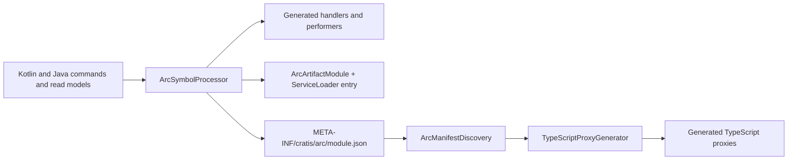

## How generated output feeds the rest of the build

`ArcManifestDiscovery.discover` scans every classpath directory and jar for
`META-INF/cratis/arc/*.json`, validates each one, and `merge` flattens them into deterministically
sorted, de-duplicated artifact lists. `GenerateArcProxies` (the `generateArcProxies` Gradle task) and
`GenerateArcProxiesCli` both run exactly that pipeline — there is no second reader and no second
renderer. A change to what the processor emits is therefore always a change to the generated proxy
surface; finish it by running the gates in
[typescript-proxies.md](./typescript-proxies.md).

At runtime the generated module is discovered through `ServiceLoader` or registered explicitly with
`ArcArtifactModuleRegistry`, which is what makes command and query dispatch reflection-free.

---

# Spring Boot Integration

This file governs `Integrations/SpringBoot` (published as `io.cratis:arc-spring-boot-starter`) and
the Spring-facing surface of the other integrations: how autoconfiguration is structured, how
optional dependencies are expressed, how configuration properties are named and documented, and how
Spring bean lifetime interacts with Arc's coroutine model. Spring Boot 4.1.x is the **only** supported
host integration baseline — see the boundary rule at the end of this file. Arc uses Jackson 3.1.x
(`tools.jackson`) for its implementation and published API. Jackson annotations intentionally remain
under `com.fasterxml.jackson.annotation`, as required by Jackson 3 itself. Framework-wide design principles
live in [framework.md](./framework.md); build wiring lives in [gradle.md](./gradle.md).
