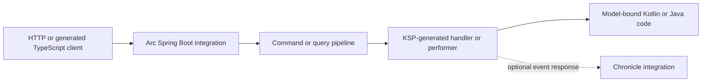

## From endpoint plumbing to application models

A conventional Spring application repeats transport concerns in controllers, service adapters, request mapping, and client code. Arc moves that plumbing to compile time. You put behavior on a command or a read model, and KSP generates reflection-free handlers, query performers, artifact metadata, validation metadata, and TypeScript proxies.

Arc is Kotlin-first and Java-first-class. Kotlin handlers can be synchronous or suspending. Java handlers can be synchronous or return `CompletionStage`. Both run through the same validation, authorization, result, and Spring MVC hosting contracts.

## Module map

| Published identity | Purpose |
| --- | --- |
| `io.cratis:arc` | Host-independent commands, queries, authentication, identity, tenancy, introspection, results, and pipelines |
| `io.cratis:arc-ksp` | KSP processor for Kotlin and Java source, manifests, concept and Jakarta validation metadata, stable diagnostics, and a checked ABI baseline |
| Gradle plugin `io.cratis.arc` (`io.cratis:arc-gradle-plugin`) | Preferred JVM/KSP setup, one-shot plus observable TypeScript proxy generation, and a checked ABI baseline |
| `io.cratis:arc-spring-boot-starter` | Spring Boot auto-configuration and servlet HTTP, SSE, and optional WebSocket hosting |
| `io.cratis:arc-spring-data-jpa` | Spring Data JPA paging, read-model, transaction, and observable `Flow` adapters |
| `io.cratis:arc-spring-data-mongodb` | Spring Data MongoDB paging, read-model, transaction, and change-stream observable `Flow` adapters |
| `io.cratis:arc-openapi-spring-boot-starter` | OpenAPI 3.1 document generation and document routes |
| `io.cratis:arc-observability-spring-boot-starter` | Micrometer observations and optional OpenTelemetry/SLF4J correlation |
| `io.cratis:arc-chronicle-spring-boot-starter` | Optional tenant-aware Chronicle transactions, concurrency, read models, side effects, and scenarios |
| `io.cratis:arc-testing` | In-process command, query, and observable-query scenarios; Chronicle contributes an optional in-memory extender |

Arc Core does not depend on Spring Boot or Chronicle. Spring Boot is the only supported host integration. Chronicle and the persistence integrations remain optional. Dedicated Kotlin and Java Chronicle sample modules demonstrate returned events, exact concurrency, tenant-local command read models, generated queries, and generated TypeScript contracts without changing the standalone samples.

## Current status

The current checkout builds as `0.0.0-SNAPSHOT` unless Gradle receives `-Pversion`. Coordinates above are publication identities, not a claim that the local snapshot is available from Maven Central or the Gradle Plugin Portal.

Implemented behavior includes model-bound commands and `provide`; one-shot and observable queries; HTTP snapshots, SSE, WebSocket, and multiplexed observable hubs; automatic Jakarta command and typed query-argument graph validation; host-neutral concept validators; scalar concept metadata in TypeScript and OpenAPI; authentication, authorization, identity, tenancy, users, tenants, and endpoint introspection; query renderers, read-model interceptors, observable emission guards, and health; Spring Data JPA/Mongo observable `Flow` support; tenant-aware Chronicle transactions, concurrency, read models, side effects, and scenarios; OpenAPI and observability starters; Kotlin conveniences and Java Core adapters; stable KSP diagnostics; ABI baselines; a differential gate against a normalized .NET-derived proxy fixture; a TypeScript runtime harness with five wired unit tests and 25 behavioral E2E tests; bounded runtime limits; and Kotlin/Java testing support. Generated clients map `LocalDate`, `LocalTime`, and `UUID` to `DateOnly`, `TimeOnly`, and `Guid`, serialize commands and GET parameters as scalar strings, and hydrate returned generated models into class instances. Arc's Core and Spring mappers use ISO-8601 strings for `Duration`; TypeScript remains `string` and OpenAPI is `string`/`duration`, not Fundamentals `TimeSpan`. `OffsetTime` also generates as textual, untyped `string`; its offset-specific semantics are not hydrated into a class. Introspection exposes UUID and supported terminal textual `java.time` values as scalar strings. Recursive type metadata uses manifest format 5 and immutable Java-friendly shape descriptors while preserving legacy constructor descriptors. Generated performers inject service, `QueryRequest`, `QueryContext`, and exact Spring Data Commons `Pageable`/`Sort` parameters in declaration order and normalize exact `Page<T>` results; Spring binding, validation, TypeScript, introspection, and OpenAPI expose only client query parameters.

Arc.Kotlin still does not claim complete Arc .NET parity. Controllers and non-Spring hosting are not planned. Spring Data's observable APIs require store notifications rather than hidden polling, OpenAPI omits the nonstandard QUERY operation, and Chronicle does not create a distributed transaction with application databases. Credit-card constraints are server-only until the pinned TypeScript client runtime exposes a compatible rule. Arc accepts and emits `LocalTime` with up to seven fractional digits for 100 ns compatibility, rejecting finer values during serialization rather than rounding or truncating them. Separately, temporal client limits include JavaScript `Date` zone/identity loss, proven `TimeOnly` truncation from raw `08:09:10.1235567` to hydrated `08:09:10.123`, and the shared generated client's explicit QUERY-body `JSON.stringify` of `DateOnly`/`TimeOnly`; use GET until upstream serialization invokes the typed serializer or `toJSON()`. Calendar/UUID, tenant-safe Spring Data command read models, and nested Chronicle ownership are completed slices. The explicit Chronicle compatibility task verifies the current 4.0.0 client and 16.44.1 kernel pairing, while cross-store partial and indeterminate outcomes remain application concerns. See the [feature parity reference](reference/parity.md) for the complete status matrix and ordered P0 backlog.

## Choose a path

Build the runnable [Kotlin tutorial](get-started/index.md) or the equivalent [Java tutorial](get-started/java.md). Use the [guides](guides/index.md) for focused tasks and the [reference](reference/index.md) for exact contracts.
