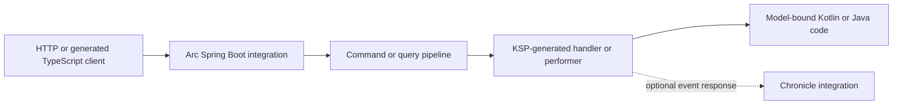

## The problem: every endpoint repeats the same plumbing

A conventional Spring Boot application writes the same shape over and over for every command and
every query: a `@RestController` method, a request DTO, a `BindingResult` check, a call into a
service, a response DTO, and — if the frontend is TypeScript — a hand-written or generated client
that has to be kept in sync by hand. None of that is the behavior you actually wanted to write. It
is the cost of getting a plain Kotlin or Java class across HTTP.

## What Arc does instead

You put behavior on the model itself. A class annotated `@Command` with a public `handle` method
*is* the command, the validation, and the endpoint. A class annotated `@ReadModel` with a static or
companion query method *is* the read model and the endpoint that serves it. [KSP](https://kotlinlang.org/docs/ksp-overview.html)
reads those annotations at compile time and generates a reflection-free handler, a route, request
and response schemas, Jakarta validation wiring, and a strict-mode TypeScript client — all before the
application ever starts.

Nothing here is reflection at request time, and nothing is hand-registered: KSP discovers every
`@Command` and `@ReadModel` on the classpath, and the generated `ArcArtifactModule` is found through
`ServiceLoader` when the application starts.

## What you get

| Without Arc | With Arc |
| --- | --- |
| A controller method per command/query, plus a service call | One annotated class; `handle` or the query method *is* the behavior |
| Manual `@Valid`/`BindingResult` checks, repeated per endpoint | Automatic Jakarta validation on command and query-argument graphs, plus reusable `ConceptValidator`/`ModelValidator` rules |
| A hand-maintained OpenAPI spec or TypeScript client | A generated, strict-mode TypeScript client from the same compile-time metadata, kept current by a Gradle task |
| Bespoke polling or a hand-rolled SSE/WebSocket endpoint for live data | `Flow`/`Flow.Publisher` query return types become HTTP snapshots, SSE, and WebSocket automatically |
| A second `AuthorizationHandler`-per-controller pattern | `@Authorize`, `@Roles`, and `@AllowAnonymous` on the command/query, evaluated by one pipeline |
| Ad hoc wiring for an event-sourced write path | An optional Chronicle integration: return events from `handle`, and Arc stages and commits them |

See [What Arc.Kotlin owns](https://github.com/Cratis/Arc.Kotlin/blob/main/README.md#what-arckotlin-owns) for the complete boundary and the
[feature parity reference](reference/parity.md) for the evidence behind every specific claim.

## When Arc is not the right fit

- **You need a non-Spring host, or hand-written controllers.** Arc targets Spring Boot exclusively
  and generates model-bound MVC endpoints; neither another host nor controller-based endpoints are
  planned. See [Non-Spring hosting](reference/parity.md) and [Controllers](reference/parity.md) in
  the parity matrix.
- **You need raw-output compatibility with Arc on .NET.** Arc.Kotlin implements the same ideas with
  JVM-native choices (coroutines and `CompletionStage` instead of `async`/`await`, `Flow` instead of
  `IObservable`). The [parity reference](reference/parity.md) tracks exactly which behaviors are
  equivalent and which intentionally diverge — read it before assuming byte-for-byte compatibility.
- **You do not want event sourcing, and you also do not want Spring Data JPA/MongoDB.** Arc.Core has
  no dependency on Chronicle or on the Spring Data integrations, but if your application has no
  persistence story at all, Arc still assumes Spring Boot as the host.

## Where to go next

- [Build your first Arc application in Kotlin](get-started/index.md) or
  [in Java](get-started/java.md) — a runnable command and query in about five minutes.
- [Coming from Spring MVC](coming-from-spring-mvc.mdx) — map familiar `@RestController` patterns onto
  Arc's model-bound commands and queries.
- [Commands](guides/commands.mdx), [queries](guides/queries.mdx) and [validation](guides/validation.md) cover the everyday work.
